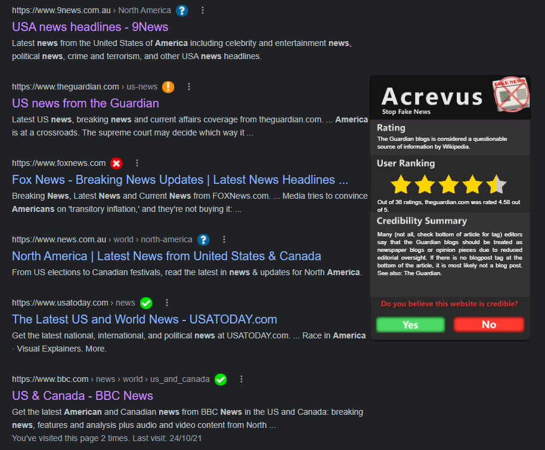

# Acrevus
A Chromium browser extension to help stop fake news (Deco3801 - Build Studio). 
Based on the report generated by Team Acrevus - Stop Fake News (Browser Extension).

Instructions:
- Go to `chrome://extensions/`, enable Developer Mode, press `Load Unpacked`, then select the `Extension` folder.
- The extension onscreen functionality can be accessed by clicking on the icons that will appear next to certain sites used for news sources. This will open a window with information specific to that site. That window can then be closed by clicking the icon again. 

Current platforms that work:
- Google
- Bing 
- Twitter (embedded links from posts)

If you click on one of the icons, it will open up the modal window, allowing you to rate the page (which will affect how the user ranking works).

 
